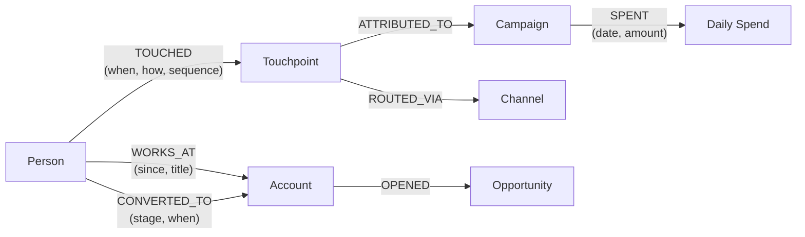
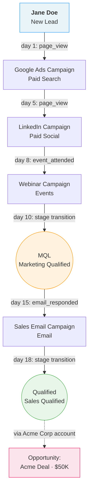
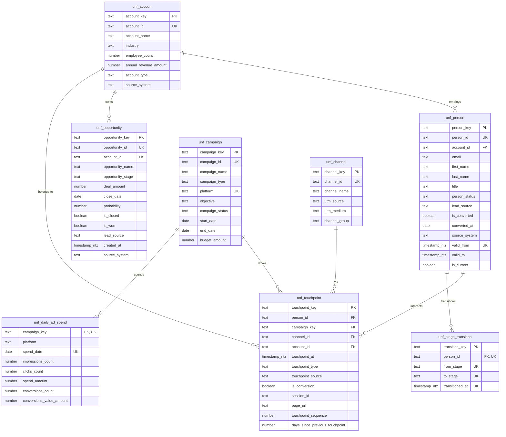

# B2B Marketing Attribution Data Platform -- Technical Design Document

## Table of Contents

1. [Executive Summary](#1-executive-summary)
2. [Data Model Architecture](#2-data-model-architecture)
3. [Standards and Patterns for Team Adoption](#3-standards-and-patterns-for-team-adoption)
4. [Schema Evolution Strategy](#4-schema-evolution-strategy)
5. [Observability Design](#5-observability-design)
6. [Rollout and Adoption Approach](#6-rollout-and-adoption-approach)
7. [Appendix](#7-appendix)

---

## 1. Executive Summary

### Problem

Marketing teams spend across CRM campaigns, paid ads (Google, LinkedIn, Meta), and owned channels but lack a unified view of which efforts drive pipeline and revenue. Data lives in three disconnected systems with different schemas, granularity, and identity models. Data science teams cannot build reliable lead scoring or churn models because feature derivation lacks point-in-time correctness.

### Solution

A layered data platform on Snowflake that:

- Unifies campaign, web, and CRM data into a single attribution model
- Serves pre-built, query-ready marts for BI dashboards (campaign ROI, MQL-to-opportunity conversion, pipeline influence)
- Provides point-in-time correct feature tables for ML models (lead scoring, churn prediction)
- Establishes standards and patterns that 5+ teams can adopt and extend

### Architecture Overview

```
  Source Systems              Transformation (dbt)                    Consumers
+----------------+     +-----+-----+-----+------+------+     +----------------+
| Salesforce CRM |     |     |     |     |      |      |     | BI Dashboards  |
| Google Ads     |---->| stg | int | unf | mrt  | feat |---->| ML Pipelines   |
| LinkedIn Ads   |     |     |     |     |      |      |     | Ad-hoc Analysis|
| Meta Ads       |     +-----+-----+-----+------+------+     | Reverse ETL    |
| GA4            |                                            +----------------+
+----------------+     Snowflake Warehouse
```

### Design Principles (For this project)

1. **Entity-centric models (not based on specific methodologies)-** -- Unified business entities (Person, Campaign, Touchpoint) are the core, not Kimball-style conformed dimensions or Data Vault hubs. This keeps the model intuitive and avoids framework overhead.
2. **Consumers drive mart design** -- Marts are wide, pre-joined, and use-case-specific. Analysts query one table, not a star schema with 4 joins.
3. **Point-in-time correctness is non-negotiable** -- Every feature table uses `as_of_date` grain with backward-looking-only windows. SCD2 on Person captures lifecycle state changes. No future data leakage.
4. **Layered contracts** -- The unified layer is the stable API. Marts and features can evolve independently. Staging is disposable. This isolates downstream consumers from source system changes.
5. **Simplicity over completeness** -- One well-tested attribution model for the purpose of this project.

### Implementation Scope

This document describes the **full platform architecture** across 5 source systems, 5 marts, and 2 feature tables. The companion code repository implements **one end-to-end slice** at production quality:

| Component | Designed (this document) | Implemented (code) |
|---|---|---|
| Source systems | Salesforce, Google Ads, LinkedIn Ads, Meta Ads, GA4 | Salesforce, Google Ads, GA4 |
| Staging models | 13 | 9 |
| Intermediate models | 4 | 4 |
| Unified models | 8 | 8 |
| Mart models | 5 (attribution, campaign ROI, pipeline influence, channel conversion, person journey) | 1 (attribution) |
| Feature models | 2 (person scoring, account signals) | 1 (person scoring) |
| Data contracts | All unified + features | All unified + features |
| CI/CD workflows | 2 (PR validation, production deploy) | 2 |
| Custom tests | 3 (attribution weights, PIT leakage, SCD2 integrity) | 3 |

**Why this slice?** The attribution path from source to ML feature exercises every layer, every engineering pattern (identity resolution, multi-source unification, incremental materialization, PIT correctness, data contracts), and every operational concern (CI/CD, testing, monitoring). The omitted marts and features follow identical patterns -- adding LinkedIn/Meta is a union, adding campaign ROI is a GROUP BY on the existing attribution output.

---

## 2. Data Model Architecture

### 2.1 Conceptual Model

The conceptual model uses semantic entity-relationship notation to capture business meaning before any implementation decisions.

#### Business Glossary

| Term | Definition | Source of Truth |
|---|---|---|
| **Person** | An individual who has interacted with marketing or sales. Unifies Leads and Contacts -- these are lifecycle stages, not separate entities. | CRM |
| **Account** | A company or organization that a Person belongs to. The unit of B2B sales. | CRM |
| **Campaign** | A deliberate marketing initiative with a defined objective, budget, and timeframe. Exists in CRM (events, emails) and ad platforms (paid media). | CRM + Ads |
| **Channel** | The medium through which a Campaign reaches a Person. Derived from UTM parameters. | Web Analytics |
| **Touchpoint** | A single recorded interaction between a Person and a Campaign or content asset. The atomic unit of attribution. | All 3 sources |
| **Session** | A continuous period of web activity by a visitor. Derived from events using `ga_session_id`, not a source entity. | Web Analytics (derived) |
| **Opportunity** | A qualified sales deal with expected revenue and close date. The revenue target for attribution. | CRM |
| **Conversion** | A Person transitioning between lifecycle stages (Anonymous to Known, Known to MQL, MQL to SQL, SQL to Opportunity, Opportunity to Closed Won). | Derived |
| **Attribution** | The method of assigning credit for a Conversion or Opportunity to one or more Touchpoints. | Derived |
| **MQL** | Marketing Qualified Lead -- a Person deemed ready for sales based on behavior and fit scoring. | CRM (Lead.Status) |
| **Pipeline** | Total value of open Opportunities. Used in pipeline influence reporting. | CRM |
| **ROI** | (Attributed Revenue - Campaign Spend) / Campaign Spend. | Derived |

#### Entity Relationships (Semantic)



**Attribution as a journey (path through the graph):**



Each TOUCHED edge becomes a row in `unf_touchpoint` (which carries both `campaign_key` and `channel_id`). Each CONVERTED_TO edge becomes a row in `unf_stage_transition`. The Person-to-Opportunity influence is indirect: Person belongs to Account, and Opportunity belongs to Account. The attribution model assigns weights across the TOUCHED edges relative to the Opportunity via this shared Account key.

#### Entity Relationship Diagram



**Reading the diagram:**

- **Entities (top half):** `unf_account`, `unf_person`, `unf_opportunity`, `unf_campaign`, `unf_channel` are descriptive, slowly changing entities.
- **Events (bottom half):** `unf_touchpoint`, `unf_stage_transition`, `unf_daily_ad_spend` are immutable facts.
- **Relationships:** A Person belongs to one Account. An Opportunity belongs to one Account. A Touchpoint connects a Person to a Campaign via a Channel. Stage Transitions track a Person's lifecycle. Daily Ad Spend tracks a Campaign's media investment.
- **PK/FK annotations** match the enforced data contracts in YAML. All surrogate keys use `dbt_utils.generate_surrogate_key`.

### 2.2 Logical Model

The logical model translates conceptual entities into a layered table structure. It is entity-centric (not Kimball star schema, not Data Vault) -- optimized for both BI consumption and ML feature engineering.

#### Layer Architecture

| Layer | Prefix | Purpose | Materialization | Audience |
|---|---|---|---|---|
| Staging | `stg_` | 1:1 with source. Clean, rename, type cast. | View | Data engineers |
| Intermediate | `int_` | Cross-source joins, identity resolution, merge logic. | View | Data engineers |
| Unified | `unf_` | Single version of truth per business entity/event. Reusable core. | Table | Everyone |
| Marts | `mrt_` | Use-case-specific, pre-joined, query-ready wide tables. | Table | BI analysts, business users |
| Features | `feat_` | Point-in-time correct, windowed aggregations for ML. | Table (incremental) | Data scientists |

#### Source Systems (13 tables)

**Salesforce CRM (via Fivetran as reference)**

| Table | Grain | Key Columns |
|---|---|---|
| `sf_account` | 1 row / account | Id, Name, Type, Industry, NumberOfEmployees, AnnualRevenue, OwnerId, CreatedDate, SystemModstamp, IsDeleted |
| `sf_contact` | 1 row / contact | Id, AccountId, FirstName, LastName, Email, Title, LeadSource, OwnerId, CreatedDate, SystemModstamp, IsDeleted |
| `sf_lead` | 1 row / lead | Id, FirstName, LastName, Email, Company, Title, Status, LeadSource, IsConverted, ConvertedContactId, ConvertedAccountId, ConvertedOpportunityId, ConvertedDate, OwnerId, CreatedDate, SystemModstamp, IsDeleted |
| `sf_opportunity` | 1 row / opportunity | Id, AccountId, Name, StageName, Amount, CloseDate, Probability, IsClosed, IsWon, LeadSource, OwnerId, CreatedDate, SystemModstamp, IsDeleted |
| `sf_campaign` | 1 row / campaign | Id, Name, Type, Status, StartDate, EndDate, IsActive, BudgetedCost, ActualCost, CreatedDate, SystemModstamp, IsDeleted |
| `sf_campaign_member` | 1 row / member | Id, CampaignId, LeadId, ContactId, Status, HasResponded, FirstRespondedDate, CreatedDate, SystemModstamp, IsDeleted |

**Google Ads (via Fivetran)**

| Table | Grain | Key Columns |
|---|---|---|
| `google_ads_campaign_history` | 1 row / campaign version | id, updated_at, customer_id, name, status (ENABLED/PAUSED/REMOVED), advertising_channel_type, start_date, end_date |
| `google_ads_campaign_stats` | 1 row / campaign / day | customer_id, date, campaign_id, clicks, impressions, cost_micros (divide by 1M), conversions, conversions_value |

**LinkedIn Ads (via Fivetran)**

| Table | Grain | Key Columns |
|---|---|---|
| `linkedin_ads_campaign_history` | 1 row / campaign version | id, last_modified_time, account_id, name, status, objective_type, daily_budget_amount, daily_budget_currency_code, cost_type |
| `linkedin_ads_ad_analytics_by_campaign` | 1 row / campaign / day | campaign_id, day, clicks, impressions, cost_in_local_currency, cost_in_usd (dual currency), external_website_conversions, one_click_leads |

**Meta Ads (via Fivetran)**

| Table | Grain | Key Columns |
|---|---|---|
| `meta_ads_campaign_history` | 1 row / campaign version | id, account_id, name, status, daily_budget, lifetime_budget, start_time, stop_time, updated_time, created_time |
| `meta_ads_basic_ad` | 1 row / ad / day | ad_id, account_id, ad_name, adset_id, adset_name, campaign_id, date, impressions, inline_link_clicks (not clicks), spend, reach, frequency |

**Web Analytics (GA4 BigQuery export, flattened)**

| Table | Grain | Key Columns |
|---|---|---|
| `ga4_events` | 1 row / event | event_date, event_timestamp, event_name, user_pseudo_id, user_id, ga_session_id, ga_session_number, page_location, page_title, page_referrer, engagement_time_msec, utm_source, utm_medium, utm_campaign, utm_content, gclid, geo_country, device_category, device_browser, platform |

#### Staging Layer (13 models)

Each staging model is a 1:1 mapping from its source table. Responsibilities:

- Rename columns to snake_case (Salesforce PascalCase to convention)
- Cast data types explicitly
- Filter soft deletes (`WHERE NOT is_deleted`)
- Add `source_system` column
- No business logic, no joins

Example mapping (`stg_salesforce__lead`):

| Source Column | Staged Column | Type |
|---|---|---|
| Id | lead_id | VARCHAR |
| FirstName | first_name | VARCHAR |
| LastName | last_name | VARCHAR |
| Email | email | VARCHAR |
| Company | company_name | VARCHAR |
| Status | lead_status | VARCHAR |
| LeadSource | lead_source | VARCHAR |
| IsConverted | is_converted | BOOLEAN |
| ConvertedContactId | converted_contact_id | VARCHAR |
| ConvertedAccountId | converted_account_id | VARCHAR |
| ConvertedOpportunityId | converted_opportunity_id | VARCHAR |
| ConvertedDate | converted_date | DATE |
| CreatedDate | created_at | TIMESTAMP_NTZ |
| LastModifiedDate | updated_at | TIMESTAMP_NTZ |

#### Intermediate Layer (4 models)

**`int_ad_platforms_unioned`** -- Unions per-platform staging models into a consistent schema.

- Reads from `stg_google_ads__campaign_stats`, `stg_linkedin_ads__ad_analytics_by_campaign`, `stg_meta_ads__basic_ad`
- Normalizes currency: Google Ads `cost_micros / 1,000,000`, LinkedIn Ads `cost_in_usd`, Meta Ads `spend` (already USD)
- Normalizes grain: Meta is ad-level, aggregated up to campaign-day to match others
- Standardizes column names: `clicks`, `impressions`, `spend_amount`, `conversions_count`
- Adds `platform` column: `google_ads`, `linkedin_ads`, `meta_ads`
- Grain: 1 row per platform per campaign per day

**`int_session_stitched`** -- Derives sessions from raw GA4 events.

- Groups events by `user_pseudo_id` + `ga_session_id` into session-level records
- Extracts: `session_start_at`, `session_end_at`, `session_duration_sec`, `page_view_count`, `event_count`
- Carries forward landing page (first `page_location`), exit page (last `page_location`), and UTM parameters from the session's first event
- Flags `has_conversion` if any event in the session is a form_submit, demo_request, or content_download
- Grain: 1 row per session (`user_pseudo_id` + `ga_session_id`)

**`int_identity_map`** -- Resolves web anonymous identities to CRM persons.

- Maps `user_pseudo_id` (GA4 cookie) to `person_id` (CRM)
- Logic: when a GA4 event has `user_id` set (post-login/form-submit), link that `user_pseudo_id` to the matching CRM person via email
- All prior anonymous touchpoints for that `user_pseudo_id` get attributed retroactively
- Grain: 1 row per `user_pseudo_id` to `person_id` mapping
- Materialized as a **view** (not ephemeral) because it contains complex logic referenced by multiple downstream models

Edge case handling:
- **One email, multiple `user_pseudo_id` values** (same person, multiple devices): all `user_pseudo_id` values map to the same `person_id`. This is expected and correct -- it unifies cross-device journeys.
- **One `user_pseudo_id`, multiple emails** (shared device or cookie reset): earliest email mapping wins. Later conflicting mappings are logged but not applied.
- **GA4 `user_id` does not match any CRM record**: web touchpoints remain attributed to the anonymous `user_pseudo_id` only. They surface in aggregate channel/campaign metrics but not in person-level attribution.
- **Email is NULL in both GA4 and CRM**: record is excluded from identity resolution. Anonymous web activity is still counted in session and channel-level reporting.

**`int_person_merged`** -- Unifies Leads and Contacts into a single Person entity.

- Leads that have been converted: use the Contact record (it is the canonical successor)
- Leads not yet converted: included as-is
- Deduplication on email address
- Carries forward the original `lead_source` from whichever record came first
- Grain: 1 row per unique person

#### Unified Layer (8 models)

**Entities (descriptive, slowly changing):**

`unf_person` (SCD Type 2)

| Column | Type | Notes |
|---|---|---|
| person_key | VARCHAR | Surrogate key (hash of person_id + valid_from) |
| person_id | VARCHAR | Natural key (stable across lead/contact) |
| account_id | VARCHAR | FK to unf_account |
| email | VARCHAR | |
| first_name | VARCHAR | |
| last_name | VARCHAR | |
| title | VARCHAR | |
| person_status | VARCHAR | New, Working, MQL, SQL, Customer |
| lead_source | VARCHAR | Original acquisition source |
| is_converted | BOOLEAN | Has this person been converted from Lead to Contact |
| converted_at | TIMESTAMP_NTZ | |
| source_system | VARCHAR | salesforce |
| valid_from | TIMESTAMP_NTZ | SCD2: when this version became effective |
| valid_to | TIMESTAMP_NTZ | SCD2: when this version was superseded (NULL = current) |
| is_current | BOOLEAN | SCD2: convenience flag for current version |
| loaded_at | TIMESTAMP_NTZ | When dbt materialized this row |

`unf_account`

| Column | Type | Notes |
|---|---|---|
| account_key | VARCHAR | Surrogate key |
| account_id | VARCHAR | Natural key |
| account_name | VARCHAR | |
| industry | VARCHAR | |
| employee_count | INTEGER | |
| annual_revenue_amount | DECIMAL(18,2) | |
| account_type | VARCHAR | Prospect, Customer, Partner |
| source_system | VARCHAR | salesforce |
| loaded_at | TIMESTAMP_NTZ | When dbt materialized this row |

`unf_campaign` (unified across CRM + ad platforms)

| Column | Type | Notes |
|---|---|---|
| campaign_key | VARCHAR | Surrogate key |
| campaign_id | VARCHAR | Natural key |
| campaign_name | VARCHAR | |
| campaign_type | VARCHAR | Email, Webinar, Paid Search, Paid Social, Display, Content |
| channel_id | VARCHAR | FK to unf_channel |
| platform | VARCHAR | salesforce, google_ads, linkedin_ads, meta_ads |
| objective | VARCHAR | |
| campaign_status | VARCHAR | |
| start_date | DATE | |
| end_date | DATE | |
| budget_amount | DECIMAL(18,2) | |
| loaded_at | TIMESTAMP_NTZ | When dbt materialized this row |

**CRM-to-ad-platform campaign mapping:** Salesforce CRM campaigns and ad platform campaigns are different entities with no native foreign key. Unification uses UTM parameter matching: ad platform campaigns embed a `utm_campaign` value that matches a naming convention tied to the Salesforce Campaign `Name` or a custom `UTM_Campaign__c` field. The mapping logic in `unf_campaign` uses `COALESCE(utm_campaign_match, campaign_id)` as the unified key. Campaigns that exist only in CRM (e.g., events, emails) or only in ad platforms (no CRM counterpart) are included as-is -- unification is additive, not exclusive.

`unf_channel` (derived from UTM patterns)

| Column | Type | Notes |
|---|---|---|
| channel_key | VARCHAR | Surrogate key |
| channel_id | VARCHAR | Natural key |
| channel_name | VARCHAR | Paid Search, Paid Social, Organic Search, Email, Event, Direct, Referral |
| utm_source | VARCHAR | google, linkedin, meta, etc. |
| utm_medium | VARCHAR | cpc, social, email, organic |
| channel_group | VARCHAR | Paid, Owned, Earned |
| loaded_at | TIMESTAMP_NTZ | When dbt materialized this row |

`unf_opportunity`

| Column | Type | Notes |
|---|---|---|
| opportunity_key | VARCHAR | Surrogate key |
| opportunity_id | VARCHAR | Natural key |
| account_id | VARCHAR | FK to unf_account |
| opportunity_name | VARCHAR | |
| opportunity_stage | VARCHAR | Prospecting, Qualification, Proposal, Negotiation, Closed Won, Closed Lost |
| deal_amount | DECIMAL(18,2) | |
| close_date | DATE | |
| probability | DECIMAL(5,2) | |
| is_closed | BOOLEAN | |
| is_won | BOOLEAN | |
| lead_source | VARCHAR | |
| created_at | TIMESTAMP_NTZ | |
| source_system | VARCHAR | salesforce |
| loaded_at | TIMESTAMP_NTZ | When dbt materialized this row |

**Events (immutable things that happened):**

`unf_touchpoint` (the core attribution entity)

| Column | Type | Notes |
|---|---|---|
| touchpoint_key | VARCHAR | Surrogate key |
| person_id | VARCHAR | FK to unf_person |
| campaign_key | VARCHAR | FK to unf_campaign (nullable -- organic touchpoints have no campaign) |
| channel_id | VARCHAR | FK to unf_channel |
| account_id | VARCHAR | FK to unf_account |
| touchpoint_at | TIMESTAMP_NTZ | When the interaction occurred |
| touchpoint_type | VARCHAR | ad_click, page_view, form_submit, email_open, event_attended, content_download |
| touchpoint_source | VARCHAR | ga4, salesforce, ad_platform |
| session_id | VARCHAR | Nullable, web touchpoints only |
| page_url | VARCHAR | Nullable, web touchpoints only |
| is_conversion | BOOLEAN | Whether this touchpoint represents a conversion event (form_submit, demo_request, content_download) |
| touchpoint_sequence | INTEGER | Sequence number per person, ordered by time |
| days_since_previous_touchpoint | INTEGER | Gap from prior touchpoint (NULL for first) |
| loaded_at | TIMESTAMP_NTZ | When dbt materialized this row |

`unf_stage_transition`

| Column | Type | Notes |
|---|---|---|
| transition_key | VARCHAR | Surrogate key |
| person_id | VARCHAR | FK to unf_person |
| from_stage | VARCHAR | Previous lifecycle stage |
| to_stage | VARCHAR | New lifecycle stage |
| transitioned_at | TIMESTAMP_NTZ | When the transition occurred |
| loaded_at | TIMESTAMP_NTZ | When dbt materialized this row |

`unf_daily_ad_spend`

| Column | Type | Notes |
|---|---|---|
| campaign_key | VARCHAR | FK to unf_campaign |
| spend_date | DATE | |
| impressions_count | INTEGER | |
| clicks_count | INTEGER | |
| spend_amount | DECIMAL(18,2) | Normalized to USD |
| conversions_count | DECIMAL(18,6) | Fractional for data-driven attribution |
| conversions_value_amount | DECIMAL(18,6) | |
| loaded_at | TIMESTAMP_NTZ | When dbt materialized this row |

#### Marts Layer (5 models)

Pre-joined, wide, query-ready tables. One table per dashboard/use case.

`mrt_campaign_roi` (grain: 1 row per campaign)

| Column | Type | Notes |
|---|---|---|
| campaign_key | VARCHAR | |
| campaign_id | VARCHAR | |
| campaign_name | VARCHAR | |
| campaign_type | VARCHAR | |
| channel_name | VARCHAR | |
| platform | VARCHAR | |
| start_date | DATE | |
| end_date | DATE | |
| budget_amount | DECIMAL | |
| total_spend_amount | DECIMAL | Sum of daily spend |
| total_impressions_count | INTEGER | |
| total_clicks_count | INTEGER | |
| click_through_rate | DECIMAL | clicks / impressions |
| cost_per_click_amount | DECIMAL | spend / clicks |
| total_touchpoint_count | INTEGER | Touchpoints attributed to this campaign |
| total_attributed_revenue_amount | DECIMAL | Revenue attributed (linear model) |
| total_pipeline_amount | DECIMAL | Open pipeline influenced |
| roi | DECIMAL | (revenue - spend) / spend |
| roas | DECIMAL | revenue / spend |

`mrt_channel_conversion` (grain: 1 row per channel per time period)

| Column | Type | Notes |
|---|---|---|
| channel_name | VARCHAR | |
| channel_group | VARCHAR | |
| period_start_date | DATE | |
| period_end_date | DATE | |
| new_leads_count | INTEGER | Leads acquired via this channel |
| mql_count | INTEGER | MQLs attributed to this channel |
| sql_count | INTEGER | SQLs attributed to this channel |
| opportunity_count | INTEGER | Opps influenced by this channel |
| closed_won_count | INTEGER | |
| lead_to_mql_rate | DECIMAL | |
| mql_to_sql_rate | DECIMAL | |
| sql_to_opportunity_rate | DECIMAL | |
| opportunity_to_closed_won_rate | DECIMAL | |
| avg_days_to_mql | DECIMAL | Average days from first touch to MQL |
| avg_days_to_opportunity | DECIMAL | |

`mrt_pipeline_influence` (grain: 1 row per campaign per opportunity)

| Column | Type | Notes |
|---|---|---|
| campaign_key | VARCHAR | |
| campaign_name | VARCHAR | |
| opportunity_id | VARCHAR | |
| opportunity_name | VARCHAR | |
| account_name | VARCHAR | |
| opportunity_stage | VARCHAR | |
| deal_amount | DECIMAL | |
| is_closed | BOOLEAN | |
| is_won | BOOLEAN | |
| touchpoint_count | INTEGER | How many touchpoints this campaign had on this opp |
| first_touchpoint_at | TIMESTAMP_NTZ | |
| last_touchpoint_at | TIMESTAMP_NTZ | |
| attribution_weight | DECIMAL | Credit assigned to this campaign for this opp |
| attributed_revenue_amount | DECIMAL | deal_amount * attribution_weight |
| influenced_pipeline_amount | DECIMAL | For open opps: deal_amount if campaign touched |

`mrt_person_journey` (grain: 1 row per person per touchpoint) -- *Optional: not required by the three core dashboards but useful for ad-hoc journey analysis*

| Column | Type | Notes |
|---|---|---|
| person_id | VARCHAR | |
| person_name | VARCHAR | |
| email | VARCHAR | |
| account_name | VARCHAR | |
| person_status | VARCHAR | Current status |
| touchpoint_sequence | INTEGER | |
| touchpoint_at | TIMESTAMP_NTZ | |
| touchpoint_type | VARCHAR | |
| campaign_name | VARCHAR | |
| channel_name | VARCHAR | |
| page_url | VARCHAR | |
| days_since_previous_touchpoint | INTEGER | |
| is_pre_mql | BOOLEAN | Did this touchpoint occur before MQL? |
| is_pre_opportunity | BOOLEAN | Did this touchpoint occur before opportunity creation? |
| opportunity_id | VARCHAR | Associated opportunity (via account) |
| deal_amount | DECIMAL | |

`mrt_attribution` (grain: 1 row per touchpoint per opportunity per model)

| Column | Type | Notes |
|---|---|---|
| touchpoint_key | VARCHAR | |
| opportunity_id | VARCHAR | |
| person_id | VARCHAR | |
| campaign_key | VARCHAR | |
| campaign_name | VARCHAR | |
| channel_name | VARCHAR | |
| touchpoint_at | TIMESTAMP_NTZ | |
| touchpoint_type | VARCHAR | |
| attribution_model | VARCHAR | linear (implemented), extensible to first_touch, last_touch, u_shaped |
| attribution_weight | DECIMAL | 0.0 to 1.0 |
| attributed_revenue_amount | DECIMAL | deal_amount * weight |
| deal_amount | DECIMAL | Total opportunity amount |
| opportunity_stage | VARCHAR | |
| is_won | BOOLEAN | |
| days_to_opportunity | INTEGER | Touchpoint to opp creation delta |

**Attribution scoping logic:** Touchpoints are linked to Opportunities through the Account entity with a time window constraint:

1. **Account linkage:** A touchpoint on Person P influences Opportunity O if P.account_id = O.account_id
2. **Time window:** Only touchpoints occurring within a configurable lookback period before the opportunity `created_at` are eligible (default: 180 days, reflecting long B2B sales cycles)
3. **Linear weighting:** Each eligible touchpoint receives equal weight: `1.0 / COUNT(eligible touchpoints for this opportunity)`

```sql
-- Attribution logic (pseudocode)
WITH eligible_touchpoints AS (
    SELECT
        t.touchpoint_key,
        t.person_id,
        t.campaign_key,
        o.opportunity_id,
        o.deal_amount,
        t.touchpoint_at,
        COUNT(*) OVER (PARTITION BY o.opportunity_id) AS total_touchpoints
    FROM unf_touchpoint t
    JOIN unf_person p ON t.person_id = p.person_id AND p.is_current
    JOIN unf_opportunity o ON p.account_id = o.account_id
    WHERE t.touchpoint_at BETWEEN o.created_at - INTERVAL '180 days' AND o.created_at
      AND t.touchpoint_at < o.created_at  -- strictly before opp creation
)
SELECT
    *,
    'linear' AS attribution_model,
    1.0 / total_touchpoints AS attribution_weight,
    deal_amount / total_touchpoints AS attributed_revenue_amount
FROM eligible_touchpoints
```

The `attribution_model` column allows future extension to first-touch (weight=1.0 for earliest touchpoint), last-touch (weight=1.0 for latest), or u-shaped (40% first, 40% last, 20% split across middle) without schema changes -- only the weighting logic changes.

**Note on account reassignment:** The attribution join uses `p.is_current` for account lookup, meaning if a person changes accounts mid-journey, all their touchpoints attribute to their current account's opportunities. This is a known B2B modeling trade-off -- the alternative (historical account lookup via SCD2) adds significant complexity for a rare edge case. For organizations with frequent account reassignment, the SCD2 join (`as_of_date BETWEEN valid_from AND valid_to`) can be substituted.

#### Features Layer (2 models)

Point-in-time correct feature tables for ML model training and inference.

`feat_person_scoring` (grain: 1 row per person per as_of_date)

| Column | Type | Notes |
|---|---|---|
| person_id | VARCHAR | |
| as_of_date | DATE | The date these features represent |
| person_status | VARCHAR | Status AS OF this date (from SCD2) |
| lead_source | VARCHAR | |
| days_since_first_touch | INTEGER | |
| days_since_last_touch | INTEGER | |
| touchpoint_count_7d | INTEGER | Touchpoints in trailing 7 days |
| touchpoint_count_30d | INTEGER | Touchpoints in trailing 30 days |
| touchpoint_count_all | INTEGER | All-time touchpoints up to as_of_date |
| distinct_channel_count_30d | INTEGER | Channel diversity |
| page_view_count_7d | INTEGER | |
| page_view_count_30d | INTEGER | |
| form_submit_count_all | INTEGER | Total form submissions |
| content_download_count_all | INTEGER | |
| has_demo_request | BOOLEAN | Ever requested a demo (before as_of_date) |
| session_count_30d | INTEGER | |
| inserted_at | TIMESTAMP_NTZ | When this row was first written by dbt |
| updated_at | TIMESTAMP_NTZ | When this row was last refreshed by dbt |

All features use `WHERE touchpoint_at < as_of_date` -- strictly backward-looking. Labels (e.g., `will_convert_to_mql_30d`) are computed separately and use `WHERE transitioned_at > as_of_date AND transitioned_at <= as_of_date + 30`.

**Note on churn prediction:** The assignment references churn prediction as an ML use case. True churn modeling requires product usage signals (login frequency, feature adoption, support tickets) that are not present in the three source systems defined here. However, `feat_account_signals` provides engagement-based churn proxies: `engagement_momentum` detects declining interaction velocity, `avg_days_since_last_touch` measures recency decay, and `active_person_count_30d` tracks stakeholder disengagement. These are meaningful leading indicators for marketing-sourced churn risk. When product usage data becomes available, it would be integrated as a fourth source with its own staging models feeding into an extended `feat_account_signals`.

`feat_account_signals` (grain: 1 row per account per as_of_date)

| Column | Type | Notes |
|---|---|---|
| account_id | VARCHAR | |
| as_of_date | DATE | |
| active_person_count_30d | INTEGER | Persons with touchpoints in last 30d |
| total_touchpoint_count_30d | INTEGER | All touchpoints across all persons |
| total_touchpoint_count_prior_30d | INTEGER | Prior 30d window for comparison |
| engagement_momentum | INTEGER | current - prior (positive = accelerating) |
| distinct_channel_count_30d | INTEGER | |
| person_count | INTEGER | Total persons at this account |
| has_open_opportunity | BOOLEAN | As of this date |
| open_pipeline_amount | DECIMAL | |
| inserted_at | TIMESTAMP_NTZ | When this row was first written by dbt |
| updated_at | TIMESTAMP_NTZ | When this row was last refreshed by dbt |

### 2.3 Physical Model (Snowflake-Specific)

#### Data Types

| Convention | Snowflake Type | Rationale |
|---|---|---|
| Surrogate keys | VARCHAR (via `dbt_utils.generate_surrogate_key`) | Deterministic, reproducible, no sequence dependency. Uses dbt-utils default hashing (configurable). |
| Natural keys | VARCHAR | Salesforce IDs are 18-char strings; ad platform IDs vary |
| Timestamps | TIMESTAMP_NTZ | All data stored in UTC. Timezone conversion is a presentation concern. |
| Monetary amounts | DECIMAL(18,2) | Precision for financial calculations |
| Fractional metrics | DECIMAL(18,6) | Ad platform conversions can be fractional |
| Counts | INTEGER | |
| Rates/ratios | DECIMAL(10,4) | |
| Booleans | BOOLEAN | |
| Free text | VARCHAR (no length constraint) | Snowflake VARCHAR is variable-length; specifying length has no performance benefit |

#### Clustering Strategy

Snowflake uses automatic micro-partitioning. Clustering keys guide the optimizer for large tables.

| Table | Clustering Key | Rationale |
|---|---|---|
| `unf_touchpoint` | `(touchpoint_at, person_id)` | Attribution queries filter by time range and join on person |
| `unf_person` | `(person_id, valid_from)` | PIT joins filter by person_id and date range against valid_from/valid_to |
| `mrt_attribution` | `(campaign_key, touchpoint_at)` | Campaign ROI queries aggregate by campaign over time |
| `feat_person_scoring` | `(as_of_date, person_id)` | ML training selects date ranges |
| `feat_account_signals` | `(as_of_date, account_id)` | Same pattern as person scoring |

Tables under ~1M rows (unf_account, unf_channel, unf_campaign) do not need clustering.

#### Materialization Strategy

| Layer | dbt Materialization | Rationale |
|---|---|---|
| Staging | View | No storage cost, always reflects current source data |
| Intermediate | View | Reusable across multiple downstream models without duplication |
| Unified | Table | Core reusable layer, must be performant for downstream reads |
| Marts | Table | Pre-computed for BI query performance |
| Features | Incremental | Large tables (person x date), append new as_of_dates daily |

#### Data Contracts

dbt data contracts are enforced on all 10 table-materialized models (8 unified + 2 features). This means the YAML column definitions are the source of truth for each model's schema -- if the SQL output doesn't match the declared columns and types, the build fails at compile time before any data is written.

**Enforcement scope:**

| Layer | Models | Contract Enforced | Rationale |
|-------|--------|-------------------|-----------|
| Staging | 13 views | No | Views cannot enforce contracts (no DDL column list). Schema is 1:1 with source. |
| Intermediate | 4 views | No | Same -- views. |
| Unified | 8 tables | Yes | Stable API boundary. All downstream marts, features, and consumers depend on this schema. |
| Marts | 5 tables | No | Fewer, known consumers. Schema evolves with dashboard needs. |
| Features | 2 incremental | Yes | ML pipelines are brittle to schema changes. Point-in-time contracts prevent silent breakage. |

**What changes in generated SQL:**

Without contracts, dbt generates `CREATE TABLE AS (SELECT ...)` and the schema is inferred from the SELECT. With contracts, dbt generates `CREATE TABLE (col1 TYPE, col2 TYPE, ...) AS (SELECT ...)` -- explicit column definitions that the warehouse enforces.

**Contract + incremental constraint:**

Both feature models use `on_schema_change='fail'` because dbt prohibits the default `'ignore'` when contracts are enabled. This means any column change requires an explicit `--full-refresh` to rebuild, which is the desired behavior for ML feature tables where silent schema drift would corrupt training data.

**YAML declaration requirements:**

Every column in a contracted model must declare `data_type`:

```yaml
models:
  - name: unf_account
    config:
      contract:
        enforced: true
    columns:
      - name: account_key
        data_type: text       # required when contract is enforced
      - name: employee_count
        data_type: number     # Snowflake NUMBER covers integer and decimal
```

#### Timestamp Strategy

Timestamps in this project fall into four categories:

| Category | Column Pattern | Where Used | Purpose |
|----------|---------------|------------|---------|
| **Business timestamps** | `created_at`, `converted_at`, `close_date` | `unf_opportunity`, `unf_person` | When the business event occurred in the source system |
| **Event timestamps** | `touchpoint_at`, `transitioned_at`, `spend_date` | `unf_touchpoint`, `unf_stage_transition`, `unf_daily_ad_spend` | When the interaction or state change happened |
| **SCD2 temporal** | `valid_from`, `valid_to` | `unf_person` | When a particular version of the record was effective |
| **Pipeline metadata** | `loaded_at`, `inserted_at`, `updated_at` | All table/incremental models | When dbt materialized or refreshed the row |

**Pipeline metadata timestamps:**

All table-materialized models (unified + marts) include a `loaded_at` column set to `current_timestamp()::timestamp_ntz`. Since these are full-rebuild tables (`CREATE TABLE AS`), every row gets the same timestamp on each build. This serves as a freshness indicator and audit trail.

Incremental models (features) include both `inserted_at` and `updated_at`:

| Column | Set when | Purpose |
|--------|----------|---------|
| `inserted_at` | Row is first written (full-refresh or new `as_of_date` batch) | Tracks when the data point first appeared in the table |
| `updated_at` | Row is written or re-written (`delete+insert` on matching keys) | Tracks when the row was last refreshed by the pipeline |

With the `delete+insert` incremental strategy, existing rows not in the new batch are untouched (timestamps preserved). New batch rows get both columns set to `current_timestamp()::timestamp_ntz`.

**Column naming rationale:** Column names are tool-agnostic (`loaded_at`, not `dbt_loaded_at`) to avoid coupling the schema to the transformation tool. This follows the same convention as business timestamps (`created_at`, `touchpoint_at`) and keeps the schema portable.

**Snowflake type note:** `current_timestamp()` returns `TIMESTAMP_LTZ` (local timezone) in Snowflake. Since the project standardizes on `TIMESTAMP_NTZ` (UTC, no timezone), all timestamp assignments use `current_timestamp()::timestamp_ntz` to match the data contract.

#### SCD2 Implementation

Person state tracking uses a two-step pipeline:

1. **`snp_person`** (dbt snapshot): Monitors `int_person_merged` for changes using the `check` strategy on columns `person_status`, `title`, `account_id`. Runs daily after staging refresh. Produces `dbt_valid_from`, `dbt_valid_to` columns.
2. **`unf_person`** (dbt table): Reads from `snp_person`, renames snapshot metadata to `valid_from`, `valid_to`, adds `is_current` convenience flag (`valid_to IS NULL`), and generates `person_key` as a hash of `person_id + valid_from`.

This separation keeps snapshot mechanics (dbt-managed) distinct from the unified layer contract (team-managed).

### 2.4 How the Model Supports Both BI and ML

| Need | BI | ML |
|---|---|---|
| Query pattern | Aggregations, GROUP BY, filters | Wide feature vectors, point-in-time joins |
| Data shape | Pre-aggregated or joinable star | One-row-per-entity-per-date, denormalized |
| Served by | `mrt_*` tables | `feat_*` tables |
| Time semantics | "Current state" or "last 30 days" | "State as of date X" (no leakage) |
| Shared foundation | Both read from `unf_*` layer | Both read from `unf_*` layer |

The unified layer is the shared contract. Mart and feature tables are opinionated transformations of the same underlying entities and events, optimized for different access patterns.

### 2.5 Trade-offs Considered

| Decision | Chosen | Alternative | Why |
|---|---|---|---|
| Modeling methodology | Entity-centric layered | Kimball star schema | The unified layer acts as a semantic contract that both BI marts and ML features build from. Kimball's conformed dimensions optimize for BI query patterns but provide no natural path for point-in-time feature derivation. Entity-centric treats the unified layer as the shared API, letting each consumer type build its own optimized views. |
| Modeling methodology | Entity-centric layered | Data Vault (hub/sat/link) | Data Vault excels at auditability and schema evolution but adds complexity. 5+ teams need simplicity. |
| Person unification | Merge lead + contact in intermediate | Keep separate dims | Leads and Contacts represent the same real-world entity at different lifecycle stages. Separate tables force every consumer to implement merge logic. |
| Identity resolution | Deterministic (email match) | Probabilistic (fuzzy matching) | Deterministic is simpler, auditable, and sufficient for B2B where email is the primary identifier. |
| Attribution models | Linear implemented, extensible via `attribution_model` column | All four models upfront | One well-tested model with a clear extension path beats four half-implemented ones. The `attribution_model` column allows adding first-touch, last-touch, or u-shaped without schema changes. |
| SCD2 scope | Only on Person | On all entities | Only Person has business-meaningful state changes (status transitions). Campaign and Account changes are rare and not needed for PIT features. |
| Ad platform source tables | Per-platform raw, unified in intermediate | Single unified raw table | Raw layer mirrors real source schemas (cost_micros, dual currency, ad-level grain). `int_ad_platforms_unioned` handles normalization before the unified layer. |
| Channel derivation | UTM-based rules | Separate maintained mapping table | UTM patterns are deterministic and auditable. A mapping table adds maintenance burden. |
| Feature materialization | Incremental by as_of_date | Full refresh daily | Feature tables grow as person x date. Incremental avoids recomputing history. |

---

## 3. Standards and Patterns for Team Adoption

### 3.1 Naming Conventions

#### Tables

| Rule | Convention | Example |
|---|---|---|
| Layer prefix | `stg_`, `int_`, `unf_`, `mrt_`, `feat_` | `stg_salesforce__lead` |
| Source separator | Double underscore `__` | `stg_salesforce__campaign_member` |
| Case | snake_case | `mrt_campaign_roi` |
| Nouns | Singular | `unf_person` not `unf_persons` |
| No abbreviations | Except universally understood (`id`, `utm`, `url`) | `unf_touchpoint` not `unf_tp` |

#### Columns

| Pattern | Convention | Example |
|---|---|---|
| Primary key | `<entity>_key` (surrogate) or `<entity>_id` (natural) | `person_key`, `campaign_id` |
| Foreign key | `<referenced_entity>_id` | `account_id` |
| Timestamps | `<event>_at` | `created_at`, `converted_at` |
| Dates | `<descriptor>_date` | `close_date`, `spend_date` |
| Booleans | `is_<state>` or `has_<thing>` | `is_converted`, `has_responded` |
| Monetary amounts | `<descriptor>_amount` | `deal_amount`, `spend_amount` |
| Counts | `<descriptor>_count` | `touchpoint_count`, `clicks_count` |
| Durations | `<descriptor>_<unit>` | `engagement_time_msec`, `days_since_last_touch` |
| Rates / ratios | `<descriptor>_rate` | `conversion_rate`, `click_through_rate` |

#### dbt Files

| Rule | Convention | Example |
|---|---|---|
| Model files | `<prefix>_<source>__<entity>.sql` (staging) or `<prefix>_<entity>.sql` (other) | `stg_salesforce__lead.sql`, `unf_person.sql` |
| Test files | `<model_name>.yml` in same directory | `staging/salesforce/_salesforce__models.yml` |
| Macro files | `<verb>_<noun>.sql` | `generate_surrogate_key.sql` |
| Seed files | `raw_<source>__<entity>.csv` | `raw_salesforce__lead.csv` |

### 3.2 Testing Strategy

#### Required Tests Per Layer

| Layer | Required Tests | Examples |
|---|---|---|
| Staging | Not null on PK, accepted values for status/type columns | `lead_id` not null, `lead_status` in ('New', 'Working', 'Qualified', 'Unqualified') |
| Unified | Unique + not null on keys, referential integrity, SCD2 validity | `person_id` + `valid_from` unique, no overlapping SCD2 ranges |
| Marts | Business rule assertions, metric bounds | ROI is not NULL when spend > 0, conversion rates between 0 and 1 |
| Features | Point-in-time correctness, no future leakage | `touchpoint_count_30d` only counts touchpoints before `as_of_date` |

#### Test Types

**Schema tests** (declarative, in YAML):

```yaml
models:
  - name: unf_person
    columns:
      - name: person_key
        tests:
          - unique
          - not_null
      - name: person_id
        tests:
          - not_null
      - name: person_status
        tests:
          - accepted_values:
              values: ['New', 'Working', 'MQL', 'SQL', 'Customer']
      - name: account_id
        tests:
          - relationships:
              to: ref('unf_account')
              field: account_id
```

**Custom data quality tests** (SQL, in `tests/` directory):

```sql
-- tests/assert_no_future_leakage_in_features.sql
-- For each person + as_of_date, verify that the reported touchpoint_count_30d
-- matches the actual count of touchpoints in the valid window.
-- Any mismatch indicates future data leakage or incorrect windowing.
WITH actual_counts AS (
    SELECT
        t.person_id,
        f.as_of_date,
        COUNT(*) AS actual_touchpoint_count_30d
    FROM {{ ref('feat_person_scoring') }} f
    JOIN {{ ref('unf_touchpoint') }} t
      ON f.person_id = t.person_id
      AND t.touchpoint_at >= f.as_of_date - INTERVAL '30 days'
      AND t.touchpoint_at < f.as_of_date  -- strictly before as_of_date
    GROUP BY 1, 2
)
SELECT
    f.person_id,
    f.as_of_date,
    f.touchpoint_count_30d AS reported,
    COALESCE(a.actual_touchpoint_count_30d, 0) AS actual
FROM {{ ref('feat_person_scoring') }} f
LEFT JOIN actual_counts a
  ON f.person_id = a.person_id AND f.as_of_date = a.as_of_date
WHERE f.touchpoint_count_30d != COALESCE(a.actual_touchpoint_count_30d, 0)
```

**Business rule tests:**

```sql
-- tests/assert_attribution_weights_sum_to_one.sql
-- For each opportunity + model, weights should sum to ~1.0
SELECT opportunity_id, attribution_model, SUM(attribution_weight) as total_weight
FROM {{ ref('mrt_attribution') }}
GROUP BY 1, 2
HAVING ABS(total_weight - 1.0) > 0.01
```

### 3.3 Patterns for Teams Building on This Model

#### Pattern 1: Adding a New Source

1. Create seed or source definition under `staging/<new_source>/`
2. Build `stg_<source>__<entity>.sql` models (1:1 with source, snake_case, type casting)
3. Extend relevant unified models (e.g., add new touchpoint types to `unf_touchpoint`)
4. Add schema tests for the new staging models
5. Existing marts automatically pick up new data through unified layer

#### Pattern 2: Adding a New Mart

1. Identify the consumer use case and required grain
2. Build `mrt_<use_case>.sql` that reads ONLY from `unf_*` models (never from staging or other marts)
3. Pre-join all needed dimensions -- mart should be queryable without joins
4. Add business rule tests
5. Document in the model's YAML file with column descriptions

#### Pattern 3: Adding a New ML Feature

1. Define the feature with its business meaning and expected predictive value
2. Add to `feat_person_scoring.sql` or `feat_account_signals.sql` (or create a new feature model)
3. Ensure backward-looking only: `WHERE <timestamp> < as_of_date`
4. Add a PIT correctness test
5. Document the feature's definition, window, and expected range

#### Pattern 4: Contribution Checklist (for PRs)

Every PR that modifies the dbt project must include:

- [ ] Model follows naming conventions
- [ ] Schema tests added for new/modified columns
- [ ] No direct references to staging from marts or features (must go through unified)
- [ ] Custom tests for business logic
- [ ] Column descriptions in YAML
- [ ] dbt docs generated and reviewed
- [ ] CI pipeline passes (build + test on PR schema)

---

## 4. Schema Evolution Strategy

### 4.1 Change Categories

| Change Type | Impact | Approach |
|---|---|---|
| **Additive** -- new column | Non-breaking | Add column with default NULL. Downstream ignores it until ready. |
| **Additive** -- new model | Non-breaking | Add model in appropriate layer. No impact on existing models. |
| **Additive** -- new source | Non-breaking | New staging models + extend unified layer. |
| **Modification** -- rename column | Breaking | Deprecation period: add new column, keep old as alias, remove after 30 days. |
| **Modification** -- change grain | Breaking | Version the model (`mrt_attribution_v2`). Keep `v1` for migration period. |
| **Modification** -- change business logic | Potentially breaking | If metric definition changes, version it. If bug fix, fix in place. |
| **Removal** -- drop column | Breaking | 30-day deprecation: mark column as deprecated in YAML, then remove. |
| **Removal** -- drop model | Breaking | 60-day deprecation: mark model as deprecated, notify consumers, then remove. |

### 4.2 Versioning Approach

**Unified layer (the contract):** Changes here affect all downstream consumers. Use dbt model versioning:

```yaml
models:
  - name: unf_person
    latest_version: 2
    versions:
      - v: 1
        deprecation_date: 2026-04-01
        description: "Original schema. Use v2 for new development."
      - v: 2
        description: "Added engagement_score column."
        columns:
          - name: engagement_score
            description: "Composite engagement metric (0-100)"
```

Consumers reference `ref('unf_person', v=1)` or `ref('unf_person')` (latest).

**Marts and features:** Can evolve more freely since they have fewer, known consumers. Still communicate changes via deprecation notices.

### 4.3 Migration Process for 50+ Downstream Consumers

1. **Announce** -- Post change RFC in shared channel, tag affected team leads
2. **Implement** -- Deploy new version alongside old (both run in production)
3. **Migrate** -- Teams update their references at their own pace within the deprecation window
4. **Validate** -- Monitor query logs to ensure no references to deprecated version
5. **Remove** -- Drop deprecated version after window closes and usage reaches zero

### 4.4 Backward Compatibility Rules

- Unified layer changes require a 30-day migration window
- Mart changes require a 14-day migration window (fewer consumers per mart)
- Feature changes require coordination with ML team only (direct communication)
- Additive changes (new columns, new models) are deployed immediately with no migration needed
- Column renames are never done in-place -- always add new, deprecate old

---

## 5. Observability Design

### 5.1 Data Quality Monitoring

| Check | Implementation | Frequency | Alert Threshold |
|---|---|---|---|
| Row count anomalies | Compare current row count to trailing 7-day average | Every run | +/- 30% deviation |
| Null rate spikes | Track NULL % for critical columns per model | Every run | > 5% NULLs on non-nullable business columns |
| Uniqueness violations | dbt test: unique on primary keys | Every run | Any failure = P1 |
| Referential integrity | dbt test: relationships between unified models | Every run | Any failure = P1 |
| Freshness | dbt source freshness: max timestamp in source tables | Every run | > 24 hours stale |
| Attribution weight validity | Custom test: weights sum to 1.0 per opportunity per model | Every run | > 0.01 deviation |
| Value distribution drift | Track distribution of key categoricals (lead_status, channel_name) | Daily | New unexpected values |

#### Sample Monitoring Queries

```sql
-- Row count trend (detect anomalies)
WITH daily_counts AS (
    SELECT
        'unf_touchpoint' AS model_name,
        CURRENT_DATE() AS check_date,
        COUNT(*) AS row_count
    FROM {{ ref('unf_touchpoint') }}
),
trailing_avg AS (
    SELECT AVG(row_count) AS avg_7d
    FROM monitoring.model_row_counts
    WHERE model_name = 'unf_touchpoint'
      AND check_date >= CURRENT_DATE() - 7
)
SELECT *
FROM daily_counts d
CROSS JOIN trailing_avg t
WHERE ABS(d.row_count - t.avg_7d) / NULLIF(t.avg_7d, 0) > 0.3;
```

```sql
-- Source freshness check
SELECT
    'sf_lead' AS source_table,
    MAX(SystemModstamp) AS latest_record,
    DATEDIFF('hour', MAX(SystemModstamp), CURRENT_TIMESTAMP()) AS hours_since_update
FROM raw.salesforce.sf_lead
HAVING hours_since_update > 24;
```

### 5.2 Pipeline Freshness

| Source | Expected Refresh | SLA |
|---|---|---|
| Salesforce CRM | Every 6 hours (Fivetran) | Data no older than 12 hours |
| Ad Platforms | Daily (Fivetran) | Data no older than 36 hours (accounts for attribution lag) |
| GA4 | Daily (BigQuery export) | Data no older than 48 hours (GA4 processes with delay) |
| dbt transformations | Daily at 06:00 UTC | Complete by 07:00 UTC |

dbt source freshness configuration:

```yaml
sources:
  - name: salesforce
    freshness:
      warn_after: {count: 12, period: hour}
      error_after: {count: 24, period: hour}
    loaded_at_field: SystemModstamp
    tables:
      - name: sf_lead
      - name: sf_contact
      - name: sf_opportunity
```

### 5.3 Cost Monitoring (Snowflake Credits)

| Metric | How to Track | Action |
|---|---|---|
| Daily credit consumption | `SNOWFLAKE.ACCOUNT_USAGE.WAREHOUSE_METERING_HISTORY` | Alert if daily cost exceeds 2x 7-day average |
| Per-model cost | Query tagging: `dbt run --vars '{query_tag: dbt_production}'` | Identify expensive models monthly |
| Warehouse utilization | `SNOWFLAKE.ACCOUNT_USAGE.QUERY_HISTORY` | Right-size warehouses quarterly |
| Feature table incremental cost | Track bytes scanned for `feat_*` models | Alert if incremental behaves like full refresh |

```sql
-- Credit consumption trend
SELECT
    DATE_TRUNC('day', start_time) AS usage_date,
    warehouse_name,
    SUM(credits_used) AS credits_used
FROM SNOWFLAKE.ACCOUNT_USAGE.WAREHOUSE_METERING_HISTORY
WHERE start_time >= CURRENT_DATE() - 30
GROUP BY 1, 2
ORDER BY 1 DESC;
```

### 5.4 Issue Detection and Response

| Severity | Definition | Response Time | Example |
|---|---|---|---|
| P1 | Data integrity violation: uniqueness, referential integrity, or PIT correctness failure | < 1 hour | `person_key` uniqueness test fails |
| P2 | Data quality degradation: null spikes, row count anomalies, freshness SLA breach | < 4 hours | Touchpoint row count drops 50% |
| P3 | Cost anomaly or performance degradation | < 24 hours | Daily credits 3x normal |
| P4 | Non-critical: documentation gaps, test coverage below target | Next sprint | New column without description |

**Alerting flow:**

```
dbt test failure --> dbt Cloud notification --> Slack #data-alerts channel
Source freshness breach --> dbt source freshness --> PagerDuty (P1/P2)
Cost anomaly --> Snowflake Resource Monitor --> Email to data platform team
```

---

## 6. Rollout and Adoption Approach

### 6.1 Phased Rollout

| Phase | Duration | Scope | Success Criteria |
|---|---|---|---|
| **Phase 0: Foundation** | Weeks 1-2 | Core platform team builds staging + unified layer. Seeds for development. | All 13 staging models, 4 intermediate models, 8 unified models pass tests. |
| **Phase 1: Pilot** | Weeks 3-4 | One analytics team (marketing ops) adopts `mrt_campaign_roi` and `mrt_channel_conversion`. | Dashboard rebuilt on new marts. Metrics match prior reports within 2%. |
| **Phase 2: ML Integration** | Weeks 4-6 | Data science team adopts `feat_person_scoring`. Validates PIT correctness against existing feature pipeline. | Lead scoring model retrained on new features. AUC within 1% of baseline. |
| **Phase 3: Expansion** | Weeks 6-10 | Remaining 3+ teams onboard. Each team builds their own marts from unified layer. | Each team has at least one production mart. |
| **Phase 4: Deprecation** | Weeks 10-14 | Legacy pipelines and dashboards decommissioned. | Zero queries against old tables. |

### 6.2 Documentation

| Asset | Format | Audience | Location |
|---|---|---|---|
| This design document | Markdown | All teams | GitHub repo root |
| dbt docs site | Auto-generated (dbt docs) | Analysts, engineers | Hosted internally |
| Column-level descriptions | YAML in dbt project | All consumers | In-repo, visible in dbt docs |
| Business glossary | Table in design doc + dbt docs | Business stakeholders, analysts | Design doc section 2.1 |
| Runbook | Markdown | On-call engineers | `docs/runbook.md` |
| Onboarding guide | Markdown | New team members | `docs/onboarding.md` |

### 6.3 Onboarding Process

For each new team:

1. **Intro session** -- Walk through design doc, demonstrate dbt docs site, show how to query marts
2. **Hands-on workshop** -- Build a simple mart from the unified layer together. Cover naming conventions, testing requirements, PR process.
3. **First PR with pairing** -- Team builds their first model with a platform team member pairing
4. **Office hours** -- Weekly 30-minute slot for questions, pattern reviews, troubleshooting

### 6.4 Support Model

| Tier | Who | Handles |
|---|---|---|
| Self-service | All teams | dbt docs, design doc, business glossary, example models |
| Office hours | Data platform team | Weekly Q&A, pattern guidance, PR reviews |
| Direct support | Data platform team | P1/P2 incidents, schema evolution requests, new source integration |
| Escalation | Data platform lead | Cross-team conflicts, breaking changes, architectural decisions |

### 6.5 Governance

- **Model ownership:** Each `unf_*` model is owned by the data platform team. Each `mrt_*` model is owned by the team that created it.
- **PR review:** All changes to `unf_*` require review from data platform team. Changes to `mrt_*` and `feat_*` require review from model owner.
- **Breaking changes:** Require RFC posted 7 days before implementation. Affected teams must acknowledge.
- **Naming enforcement:** CI pipeline validates naming conventions on every PR (linting via dbt-checkpoint or sqlfluff).

---

## 7. Appendix

### 7.1 dbt Project Structure (Implemented Slice)

The repository implements the core attribution path. Files marked with `(*)` would be added for the full architecture.

```
marketing-attribution-dbtsnowflake/
  dbt_project.yml
  packages.yml
  profiles.yml
  .gitignore
  .sqlfluff
  README.md
  DESIGN_DOCUMENT.md
  seeds/
    salesforce/
      raw_salesforce__account.csv
      raw_salesforce__contact.csv
      raw_salesforce__lead.csv
      raw_salesforce__opportunity.csv
      raw_salesforce__campaign.csv
      raw_salesforce__campaign_member.csv
    google_ads/
      raw_google_ads__campaign_history.csv
      raw_google_ads__campaign_stats.csv
    ga4/
      raw_ga4__event.csv
    (*) linkedin_ads/                       # Same pattern as google_ads
    (*) meta_ads/                           # Same pattern as google_ads
  models/
    staging/
      salesforce/
        _salesforce__sources.yml
        _salesforce__models.yml
        stg_salesforce__account.sql
        stg_salesforce__contact.sql
        stg_salesforce__lead.sql
        stg_salesforce__opportunity.sql
        stg_salesforce__campaign.sql
        stg_salesforce__campaign_member.sql
      google_ads/
        _google_ads__sources.yml
        _google_ads__models.yml
        stg_google_ads__campaign_history.sql
        stg_google_ads__campaign_stats.sql
      ga4/
        _ga4__sources.yml
        _ga4__models.yml
        stg_ga4__event.sql
      (*) linkedin_ads/                     # 2 staging models
      (*) meta_ads/                         # 2 staging models
    intermediate/
      _intermediate__models.yml
      int_ad_platforms_unioned.sql           # Currently Google only; union point for additional platforms
      int_session_stitched.sql
      int_identity_map.sql
      int_person_merged.sql
    unified/
      _unified__models.yml                  # Data contracts enforced on all 8 models
      unf_account.sql
      unf_person.sql
      unf_campaign.sql                      # Currently Salesforce + Google; union point for additional platforms
      unf_channel.sql
      unf_opportunity.sql
      unf_touchpoint.sql
      unf_stage_transition.sql
      unf_daily_ad_spend.sql
    marts/
      _marts__models.yml
      _marts__exposures.yml
      mrt_attribution.sql                   # Core: linear multi-touch attribution
      (*) mrt_campaign_roi.sql              # Aggregates attribution output by campaign
      (*) mrt_channel_conversion.sql        # MQL-to-SQL funnel rates by channel
      (*) mrt_pipeline_influence.sql        # Campaign credit per opportunity
      (*) mrt_person_journey.sql            # Full touchpoint timeline per person
    features/
      _features__models.yml                 # Data contracts enforced, incremental
      feat_person_scoring.sql               # PIT-correct lead scoring features
      (*) feat_account_signals.sql          # Account-level engagement features
  tests/
    assert_attribution_weights_sum_to_one.sql
    assert_no_future_leakage_in_features.sql
    assert_scd2_no_overlapping_ranges.sql
  macros/
    generate_schema_name.sql
    (*) safe_divide.sql
  (*) snapshots/
    (*) snp_person.sql
  .github/
    workflows/
      ci.yml
      production.yml
```

### 7.2 Technology Stack

| Component | Tool | Rationale |
|---|---|---|
| Warehouse | Snowflake | Assignment requirement |
| Transformation | dbt Core / dbt Cloud | Industry standard for analytics engineering |
| CI/CD | GitHub Actions | Validates builds and tests on PR |
| Version control | Git / GitHub | Standard |
| Documentation | dbt docs (auto-generated) | Lives with the code |
| Orchestration | dbt Cloud (or Airflow) | Scheduled runs, monitoring |
| Linting | sqlfluff + dbt-checkpoint | Enforce naming conventions and SQL style |

### 7.3 AI Tools Usage

AI assistance was used for:

- Research on source system schemas (Salesforce, GA4, ad platform APIs via Fivetran)
- Iterating on data model design decisions and trade-off analysis & documentation
- Generating seed data with cross-source referential consistency
- Scaffolding dbt project structure and boilerplate
- Reviewing naming conventions against industry best practices

All architectural decisions, trade-off evaluations, and business logic were authored and validated by the author.
