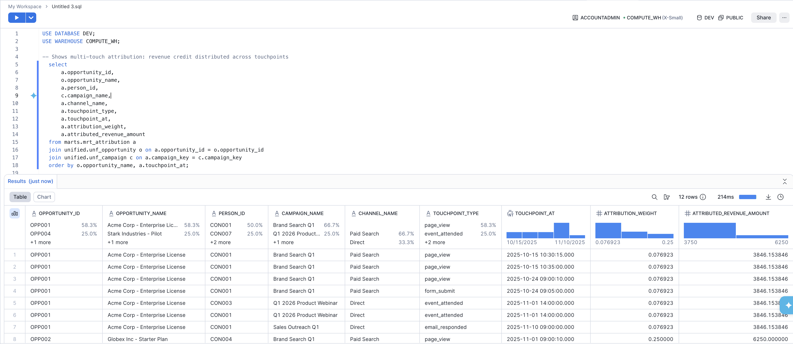
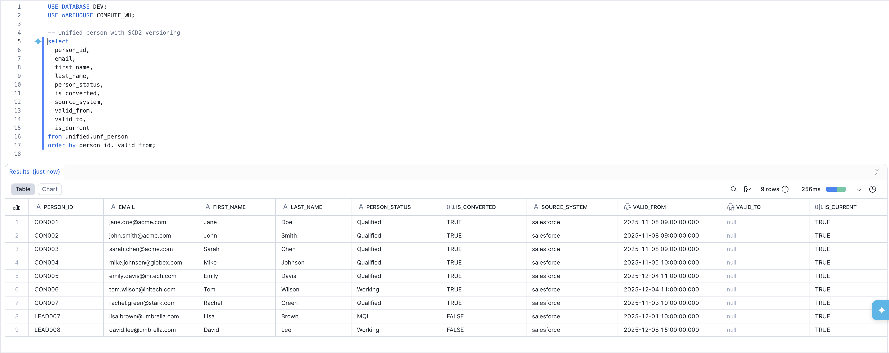
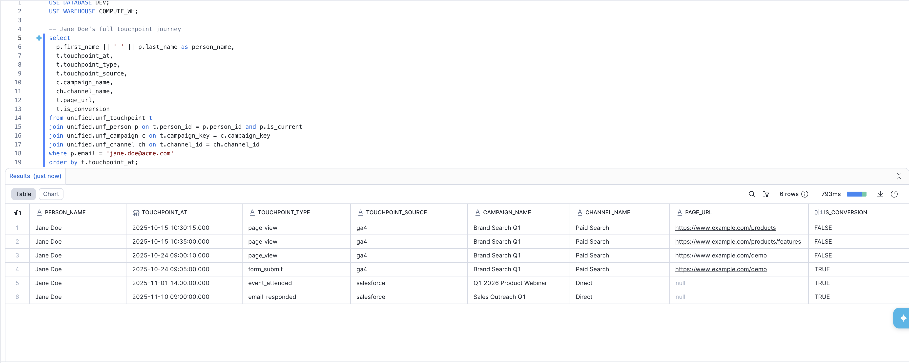
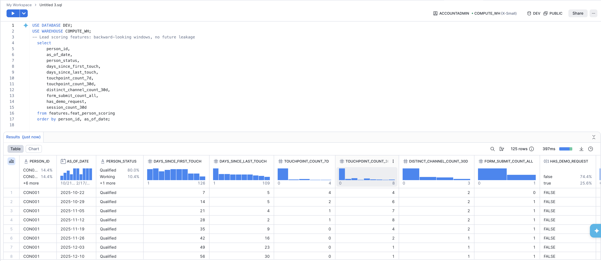

# Marketing Attribution Data Platform

[](https://github.com/hfmsio/marketing-attribution-dbtsnowflake/actions/workflows/ci.yml)

## What This Project Does

B2B marketing teams run campaigns across multiple channels (paid search, paid social, email, webinars, content) but struggle to answer: **which campaigns actually drive pipeline and revenue?**

This project solves that by building a unified attribution data platform that:

1. **Ingests data from 3 source systems** -- Salesforce CRM (accounts, contacts, leads, opportunities, campaigns), Google Ads, and Google Analytics 4
2. **Resolves identity across systems** -- links anonymous GA4 web visitors to known CRM contacts/leads via email matching, then ties them to accounts and opportunities
3. **Builds a unified touchpoint timeline** -- every meaningful interaction (page views, form submissions, demo requests, campaign responses, ad clicks) sequenced per person
4. **Runs multi-touch attribution** -- linear attribution model with 180-day lookback window that distributes opportunity revenue credit equally across all pre-opportunity touchpoints
5. **Generates ML feature tables** -- point-in-time correct feature engineering for lead scoring, with strict backward-looking windows to prevent data leakage

This is an **implemented slice** of a larger design (see the companion design document). The full architecture supports 5 source systems, 5 marts, and 2 feature tables. This slice implements one complete end-to-end path -- from raw source data to attribution mart and ML features -- at production quality.

## Architecture

```
Sources          Staging        Intermediate      Unified               Marts / Features
-----------      ----------     -------------     ----------            -----------------
Salesforce  -->  stg_sf__*  -->                    unf_account           mrt_attribution
Google Ads  -->  stg_ga__*  --> int_ad_platforms    unf_person            feat_person_scoring
GA4         -->  stg_ga4__* --> int_session_stitch  unf_opportunity
                                int_identity_map    unf_campaign
                                int_person_merged   unf_touchpoint
                                                    unf_channel
                                                    unf_stage_transition
                                                    unf_daily_ad_spend
```

**Layer responsibilities:**

| Layer | Materialization | Purpose |
|-------|----------------|---------|
| Staging | View | 1:1 source cleaning, renaming, type casting, soft-delete filtering |
| Intermediate | View | Cross-source joins, identity resolution, session stitching, ad platform unioning |
| Unified | Table | Entity-centric business objects with enforced data contracts |
| Marts | Table | Multi-touch attribution with linear weighting |
| Features | Incremental | Point-in-time ML feature tables with backward-looking windows |

## Prerequisites

- Python 3.10+
- Snowflake account with a warehouse and database
- [uv](https://docs.astral.sh/uv/) (recommended) or pip
- Git

## Quick Start

### 1. Clone the repository

```bash
git clone <repo-url>
cd marketing-attribution-dbtsnowflake
```

### 2. Create a Python virtual environment and install dbt

**One-liner setup (copy-paste):**
```bash
python3 -m venv .venv && .venv/bin/pip install -q dbt-snowflake~=1.11.0
```

Or using [uv](https://docs.astral.sh/uv/) (faster):
```bash
uv venv --python 3.12 && uv pip install dbt-snowflake~=1.11.0
```

Verify installation:
```bash
.venv/bin/dbt --version
# Should show: dbt-core 1.11.x, dbt-snowflake 1.11.x
```

**Note:** You do not need to activate the venv. All commands below use `.venv/bin/dbt` directly, which is explicit and avoids shell state issues.

### 3. Set up Snowflake credentials

Create `~/.dbt/profiles.yml` (this file lives outside the repo and is never committed):

```bash
mkdir -p ~/.dbt
```

```yaml
# ~/.dbt/profiles.yml
marketing_attribution:
  target: dev
  outputs:
    dev:
      type: snowflake
      account: <your-account>          # e.g. WUNASNT-MMB72039
      user: <your-username>
      password: <your-password>        # or use authenticator: externalbrowser for SSO
      database: <your-database>        # e.g. DEV
      warehouse: <your-warehouse>      # e.g. COMPUTE_WH
      schema: marketing_attribution    # dbt's default schema (models use custom schemas)
      threads: 4
```

**Finding your Snowflake account identifier:** Log into Snowflake, click your account name in the bottom-left, then "Account". The identifier is in the format `ORGNAME-ACCOUNTNAME` (e.g. `WUNASNT-MMB72039`).

**Important:** The repo contains a `profiles.yml` for CI/CD that uses environment variables. For local development, always pass `--profiles-dir ~/.dbt` when running from the project root. See the [Profile Resolution](#profile-resolution) section below.

### 4. Verify connection

```bash
.venv/bin/dbt debug --profiles-dir ~/.dbt
```

You should see `All checks passed!` at the bottom.

### 5. Install dbt packages

```bash
.venv/bin/dbt deps
```

### 6. Load seed data and build

```bash
# Load seed CSVs into Snowflake (creates raw_* schemas automatically)
.venv/bin/dbt seed --profiles-dir ~/.dbt

# Build all models and run all tests
.venv/bin/dbt build --full-refresh --profiles-dir ~/.dbt
```

### 7. Generate and serve docs

```bash
.venv/bin/dbt docs generate --profiles-dir ~/.dbt
.venv/bin/dbt docs serve --profiles-dir ~/.dbt
```

### Profile Resolution

The repo includes a `profiles.yml` for CI/CD pipelines. dbt prioritizes the local directory's file over `~/.dbt/`, so always specify which to use:

```bash
# Option A: Always pass --profiles-dir (explicit, recommended)
.venv/bin/dbt build --profiles-dir ~/.dbt

# Option B: Set an environment variable (add to your .zshrc / .bashrc)
export DBT_PROFILES_DIR=~/.dbt

# Option C: Rename the repo's profiles.yml locally
mv profiles.yml profiles.yml.ci
```

### Dropping Everything and Rebuilding from Scratch

```bash
# Step 1: Clean local build artifacts and reinstall packages
.venv/bin/dbt clean && .venv/bin/dbt deps

# Step 2: Drop all warehouse schemas (create a temporary macro, or run manually in Snowflake)
# DROP SCHEMA IF EXISTS raw_salesforce CASCADE;
# DROP SCHEMA IF EXISTS raw_google_ads CASCADE;
# DROP SCHEMA IF EXISTS raw_ga4 CASCADE;
# DROP SCHEMA IF EXISTS staging CASCADE;
# DROP SCHEMA IF EXISTS intermediate CASCADE;
# DROP SCHEMA IF EXISTS unified CASCADE;
# DROP SCHEMA IF EXISTS marts CASCADE;
# DROP SCHEMA IF EXISTS features CASCADE;

# Step 3: Reload seeds then full build
.venv/bin/dbt seed --profiles-dir ~/.dbt
.venv/bin/dbt build --full-refresh --profiles-dir ~/.dbt
```

**Why seed before build?** Staging models use `{{ source() }}` which points to seed schemas. There is no DAG edge between seeds and source-backed models, so `dbt build` may try to create staging views before seeds exist.

## Project Structure

```
marketing-attribution-dbtsnowflake/
  .github/workflows/
    ci.yml                    # PR validation
    production.yml            # Daily prod build + docs
  macros/
    generate_schema_name.sql  # Schema routing override
  models/
    staging/
      salesforce/             # 6 models + source/model YAML
      google_ads/             # 2 models
      ga4/                    # 1 model
    intermediate/             # 4 cross-source models
    unified/                  # 8 entity models with data contracts
    marts/                    # 1 attribution model + exposures
    features/                 # 1 incremental ML feature table
  seeds/                      # 9 CSVs across 3 source directories
  tests/                      # 3 custom SQL tests
  profiles.yml                # CI/CD profiles (env_var based)
  dbt_project.yml
  packages.yml
  .sqlfluff                   # SQL linting config
```

## Schemas

| Schema | Contents |
|--------|----------|
| `raw_salesforce` | Seed tables (accounts, contacts, leads, opportunities, campaigns, campaign_members) |
| `raw_google_ads` | Seed tables (campaign history, campaign stats) |
| `raw_ga4` | Seed table (events) |
| `staging` | Staging views (9 models) |
| `intermediate` | Intermediate views (4 models) |
| `unified` | Unified entity tables with enforced data contracts (8 models) |
| `marts` | Attribution table (1 model) |
| `features` | Incremental feature table (1 model) |

## Key Commands

```bash
# Full build (seed + models + tests)
dbt build --profiles-dir ~/.dbt

# Build a single layer
dbt build --select staging --profiles-dir ~/.dbt
dbt build --select unified --profiles-dir ~/.dbt

# Build a model and everything downstream
dbt build --select unf_person+ --profiles-dir ~/.dbt

# Force full rebuild of incremental models
dbt build --full-refresh --profiles-dir ~/.dbt

# Run tests only
dbt test --profiles-dir ~/.dbt

# Check source freshness
dbt source freshness --profiles-dir ~/.dbt

# Preview model output without materializing
dbt show --select stg_salesforce__lead --limit 10 --profiles-dir ~/.dbt

# Lint SQL
sqlfluff lint models/
sqlfluff fix models/
```

## Data Contracts

All 8 unified layer models and the feature model enforce data contracts (`contract: {enforced: true}`):

- Every column is declared in YAML with a `data_type`
- If SQL output doesn't match the contract (wrong type, missing column, extra column), the build fails at compile time
- Downstream consumers can rely on a stable schema

## Tests

Schema tests and 3 custom business-rule tests:

- **Schema tests**: unique, not_null, accepted_values, relationships across all layers
- `assert_attribution_weights_sum_to_one` -- validates linear attribution math (weights per opportunity sum to 1.0)
- `assert_no_future_leakage_in_features` -- independently recomputes features from raw data to verify no future data leakage
- `assert_scd2_no_overlapping_ranges` -- validates SCD2 temporal integrity on the person model

## CI/CD

**PR validation** (`ci.yml`): triggers on pull requests to `main`. Seeds data, builds all models, runs all tests in an isolated `ci_pr_<run_id>` schema.

**Production** (`production.yml`): triggers on merge to `main` and daily at 06:00 UTC. Checks source freshness, builds all models, generates docs.

Both pipelines read Snowflake credentials from GitHub Actions secrets:

| Secret | Required | Description |
|--------|----------|-------------|
| `SNOWFLAKE_ACCOUNT` | Yes | Account identifier (e.g. `WUNASNT-MMB72039`) |
| `SNOWFLAKE_USER` | Yes | Snowflake username |
| `SNOWFLAKE_PASSWORD` | Yes | Snowflake password |
| `SNOWFLAKE_DATABASE` | No | Database name (defaults to `DEV`) |
| `SNOWFLAKE_WAREHOUSE` | No | Warehouse name (defaults to `COMPUTE_WH`) |

## Sample Output

<details>
<summary>Multi-touch attribution: revenue credit distributed across touchpoints</summary>


</details>

<details>
<summary>Unified person entity with SCD2 versioning</summary>


</details>

<details>
<summary>Jane Doe's full touchpoint journey: anonymous web visits linked to known CRM identity</summary>


</details>

<details>
<summary>ML feature table: backward-looking windows with no future leakage</summary>


</details>

## Design Decisions

**Why this slice?** The companion design document covers the full 5-source, 5-mart, 2-feature architecture. This implementation focuses on one complete end-to-end path that demonstrates:

- Multi-source integration (CRM + ads + web analytics)
- Identity resolution across anonymous and known users
- Multi-touch attribution with configurable lookback
- Point-in-time correct ML features with incremental materialization
- Data contracts for schema stability
- CI/CD with isolated environments

Additional marts (campaign ROI, pipeline influence, channel conversion) and features (account signals) follow the same patterns and are documented in the design document.

**Why linear attribution?** Linear is transparent, debuggable, and a solid baseline. First-touch and last-touch can be derived from the same output by filtering on touchpoint sequence. More complex models (time-decay, position-based, Shapley) would only modify the weight formula.

**Why entity-centric, not Kimball?** Unified entities (Person, Campaign, Touchpoint) are the core abstraction. Analysts query pre-joined marts, not star schemas with 4 joins. This reduces cognitive load and makes the model intuitive for non-technical consumers.

## AI Tools Usage

This project was developed with AI assistance. AI was used for:

- Researching source system schemas (GA4 event structure, Salesforce object model, ad platform APIs)
- Generating seed CSV data with realistic cross-source relationships
- Scaffolding boilerplate (YAML configs, CI/CD workflows, staging model structure)
- Code review and identifying logic errors in attribution SQL

All design decisions, architecture choices, and business logic were made by the author. The AI served as a development accelerator, not a decision-maker.
